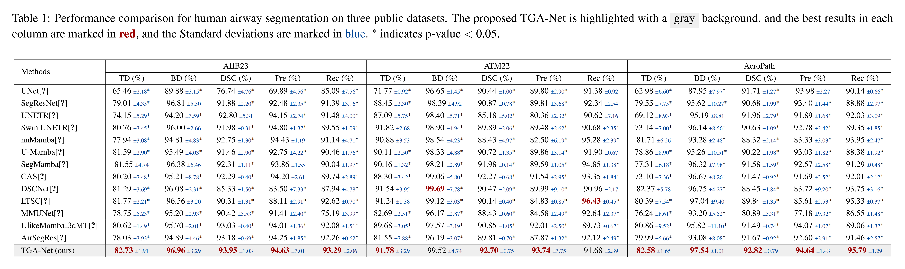

# TGA-Net: A Specialized Framework with Tri-Directional Gated Activation for Pulmonary Airway Segmentation
> More details of this project will be released soon.

Pulmonary airway segmentation faces two fundamental challenges: (a) Tri-directional Distinct Distribution: The pulmonary airway exhibits striking plane-dependent morphological divergence across orthogonal imaging planes, manifesting as Sectional Puncta, Branching Arbor, and Longitudinal Tube. (b) Pulmonary Parenchymal Background Interference: The juxtaposition of the airway tree and pulmonary parenchyma gives rise to substantial background confounding, replete with dense, high-frequency artifacts and pathological features. TGA-Net explicitly addresses these challenges to reconstruct continuous and complete airway tree structures.


# Network Architecture
Overview of the proposed TGA-Net architecture. The framework integrates two core components: The Dual-Stream Mixer (DSM) synergistically combines a Token Mixer to capture fine-grained local details with a Mamba-enhanced Feed-Forward Network for modeling global topology. The Tri-Directional Guider (TDG) is deployed in the skip connections to explicitly model tubular airway geometry via tri-directional spatial disentanglement projections, and leverages a controllable gated activation mechanism to suppress parenchymal noise.


# Data Description
The AIIB23 dataset focuses on fibrotic lung diseases and COVID-19, containing 312 High-Resolution CT (HRCT) scans sourced from three institutions. 
```bibtex
@article{nan2024hunting,
  title={Hunting imaging biomarkers in pulmonary fibrosis: Benchmarks of the AIIB23 challenge},
  author={Nan, Y. and Xing, X. and Wang, S. and Tang, Z. and Felder, F.N. and Zhang, S. and others},
  journal={Medical Image Analysis},
  volume={97},
  pages={103253},
  year={2024},
  publisher={Elsevier}
}
```

The ATM22 dataset is a large-scale benchmark collected from multiple centers, consisting of 500 chest CT scans characterized by significant heterogeneity in scanning parameters.
```bibtex
@article{zhang2023multi,
  title={Multi-site, multi-domain airway tree modeling},
  author={Zhang, M. and Wu, Y. and Zhang, H. and Qin, Y. and Zheng, H. and Tang, W. and others},
  journal={Medical Image Analysis},
  volume={90},
  pages={102957},
  year={2023},
  publisher={Elsevier}
}
```

The AeroPath dataset comprises chest CT scans from 27 subjects with diverse pathologies, including malignant tumors and emphysema, depicting complex airway structures.
```bibtex
@article{stoverud2024aeropath,
  title={AeroPath: An airway segmentation benchmark dataset with challenging pathology and baseline method},
  author={St{\o}verud, K.-H. and Bouget, D. and Pedersen, A. and Leira, H.O. and Amundsen, T. and Lang{\o}, T. and Hofstad, E.F.},
  journal={PLoS One},
  volume={19},
  pages={e0311416},
  year={2024},
  publisher={Public Library of Science}
}
```

# Benchmark



# Visualization
Qualitative comparison of 3D airway segmentation results of the proposed TGA-Net against leading state-of-the-art methods. Red indicates True Positives, while Green denotes False Positives.

